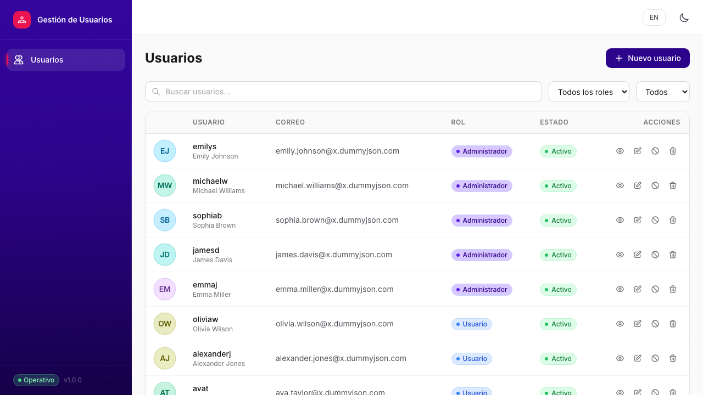
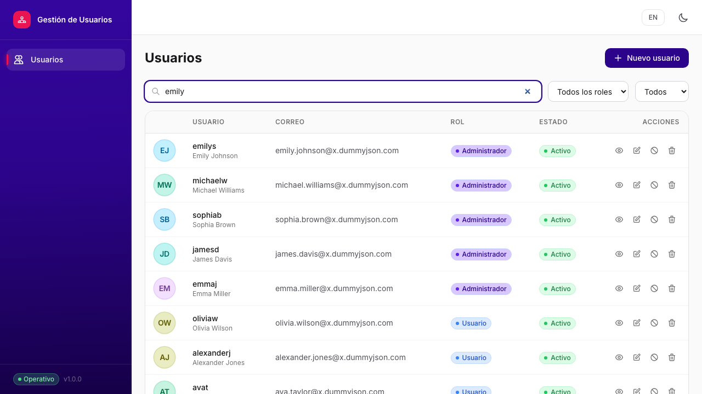
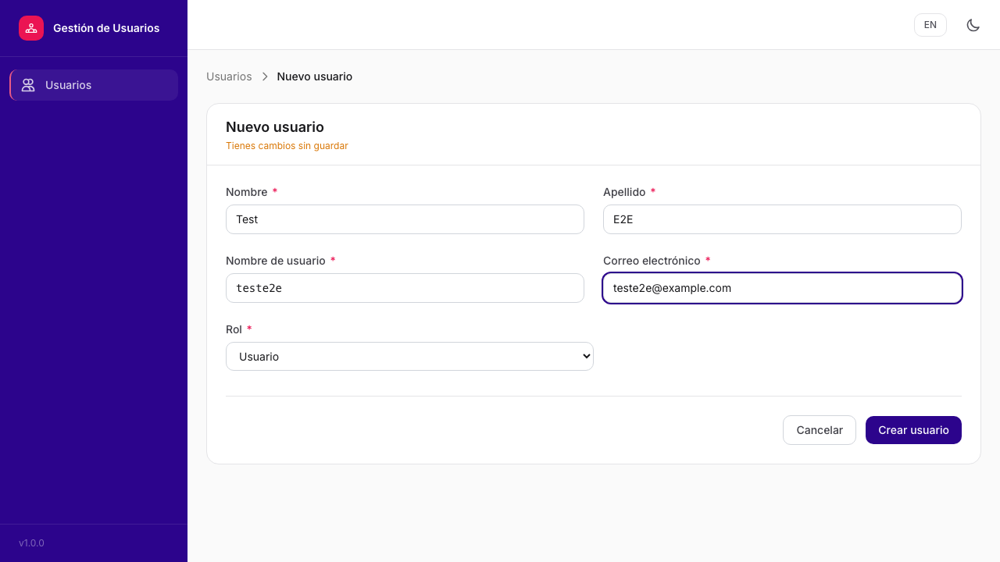
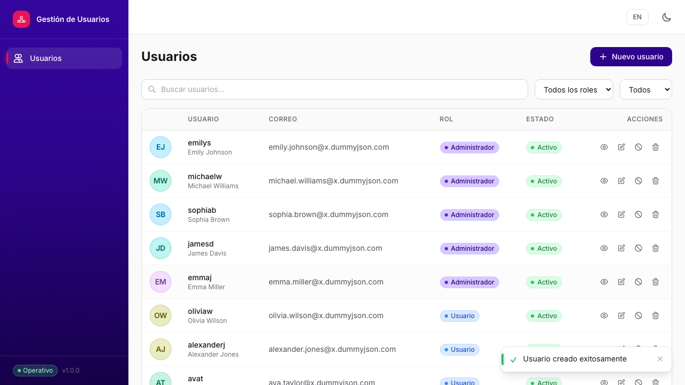
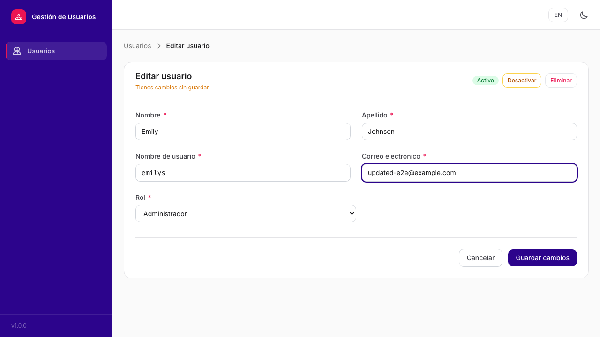
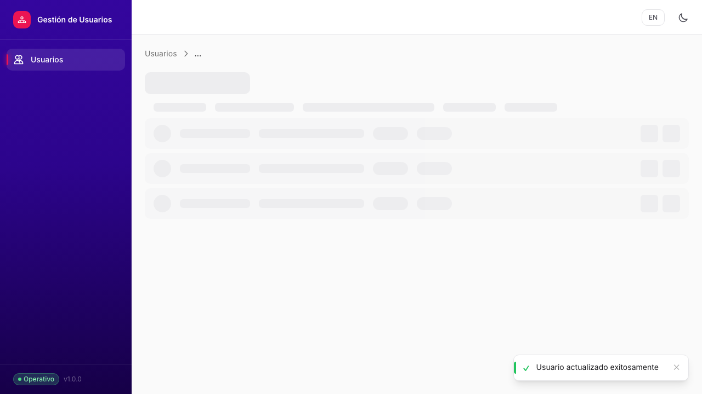
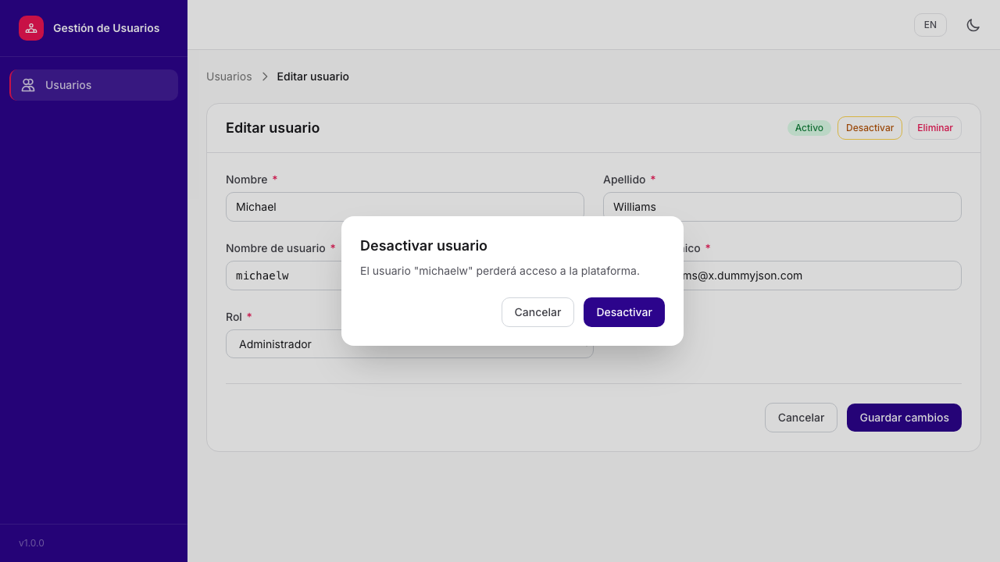
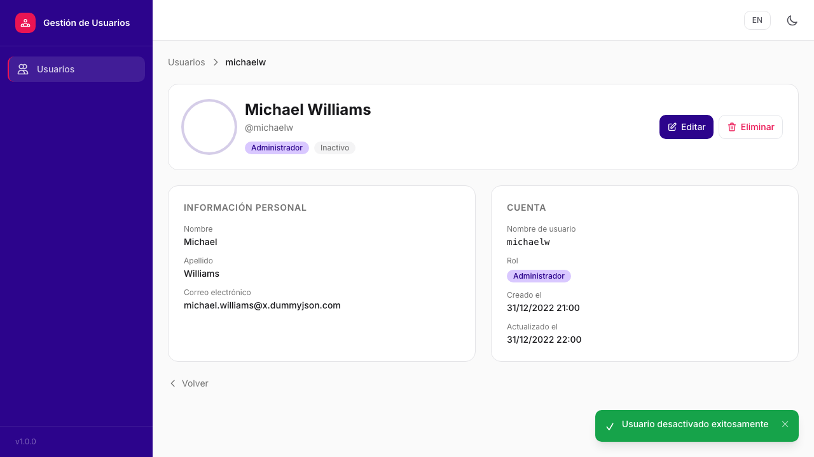

# User Management App

A Single Page Application for internal admin user management, built as a frontend engineering challenge.

**Stack:** Angular 18 · Tailwind CSS v3 · Angular CDK · Angular Signals · TypeScript strict mode

---

## Getting Started

### Prerequisites

- Node.js 18+ (LTS recommended)
- npm 9+

### Install

```bash
git clone https://github.com/b-vera/user-management-app.git
cd user-management-app
npm install
```

### Run locally

```bash
npm start
# → http://localhost:4200
```

### Run unit tests

```bash
npm test
# or target a specific file:
npx ng test --include="**/user-api.service.spec.ts" --watch=false
```

### Run E2E tests

```bash
# The dev server must be running first (npm start)
npm run e2e
```

### Build for production

```bash
npm run build:prod
# Output: dist/user-management-app/browser/
```

The production build uses AOT compilation, tree-shaking, and lazy-loaded routes. Verify with:

```bash
npx ng build --configuration production --stats-json
```

---

## API Configuration

The API base URL is set in the environment files:

| File | Purpose | Default |
|------|---------|---------|
| `src/environments/environment.ts` | Local dev | `https://dummyjson.com` |
| `src/environments/environment.production.ts` | Production build | `https://dummyjson.com` |

To point to a different backend, change `apiUrl` in the relevant file:

```ts
export const environment: AppEnvironment = {
  production: false,
  apiUrl: 'https://your-api.example.com',
  logLevel: 'debug',
};
```

The `HttpInterceptor` at `src/app/core/interceptors/api.interceptor.ts` prepends `apiUrl` to every request and maps `HttpErrorResponse` to a typed `AppError`.

---

## API Choice: DummyJSON

**URL:** `https://dummyjson.com/users`

Chosen because it offers the closest data shape to the challenge schema, supports paginated `GET`, search, and simulated `POST` / `PUT` / `DELETE` — all with typed responses.

### Field mapping

DummyJSON's user schema differs from the challenge schema. The `mapDummyJsonToUser()` function in `src/app/core/models/user.model.ts` handles the translation:

| DummyJSON field | App field | Notes |
|----------------|-----------|-------|
| `firstName` | `first_name` | renamed |
| `lastName` | `last_name` | renamed |
| `role` | `role` | validated against `admin \| user \| guest` |
| *(missing)* | `active` | `raw.active ?? true` — echoed back on PUT; defaults to `true` on GET |
| *(missing)* | `created_at` | deterministic fake date derived from list index |
| *(missing)* | `updated_at` | `created_at + 1 h` |

### Simulated persistence

DummyJSON does not persist mutations. The app uses an in-memory Angular Signals store (`UserStoreService`) to simulate persistence **within the session**:

- **Optimistic updates**: mutations are applied to the store immediately, before the API responds.
- **Rollback**: if the API returns an error, the previous snapshot is restored.
- **POST / PUT / DELETE** responses are merged with the sent payload so fields not echoed by the API (e.g. `active`) are preserved in the store.
- Reloading the page resets the store and re-fetches from DummyJSON — this is expected and documented behaviour for a demo API.

---

## Endpoint Mapping

| View | HTTP | Endpoint | Service method |
|------|------|----------|----------------|
| User list (paginated) | `GET` | `/users?limit=10&skip=0` | `UserApiService.getUsers()` |
| User list (search) | `GET` | `/users/search?q=…&limit=…&skip=…` | `UserApiService.searchUsers()` |
| User detail | `GET` | `/users/:id` | `UserApiService.getUserById()` |
| Create user | `POST` | `/users/add` | `UserApiService.createUser()` |
| Edit user | `PUT` | `/users/:id` | `UserApiService.updateUser()` |
| Deactivate user | `PUT` | `/users/:id` | `UserApiService.updateUser()` |
| Delete user | `DELETE` | `/users/:id` | `UserApiService.deleteUser()` |

---

## State Management

**Chosen approach:** Service-based store with Angular Signals (`UserStoreService`).

**Justification:** The domain is a single entity (users) with straightforward CRUD. Angular Signals provide fine-grained reactivity without the boilerplate of NgRx (actions, reducers, selectors, effects). The optimistic update pattern with rollback is cleanly expressed as a private `_optimistic<T>()` helper. For a larger domain or cross-feature coordination, NgRx Signals would be the natural next step.

---

## Screenshots

### User list



### Search



### Create user



### Create success toast



### Edit user



### Edit success toast



### Deactivate confirmation dialog



### Deactivated badge



---

## Project Structure

```
src/
├── app/
│   ├── core/
│   │   ├── interceptors/     # HttpInterceptor (base URL + error mapping)
│   │   ├── models/           # User interfaces + DummyJSON mapper
│   │   ├── services/         # UserApiService, LoggerService, ToastService, ConfirmDialogService
│   │   └── store/            # UserStoreService (Angular Signals)
│   ├── features/
│   │   └── users/
│   │       ├── user-list/    # Paginated list with search + role/status filters
│   │       ├── user-detail/  # Read-only detail view
│   │       └── user-form/    # Create / Edit reactive form
│   └── shared/
│       ├── components/       # AppShell, ConfirmDialog, ToastContainer, SkeletonLoader
│       └── validators/       # noWhitespace, validRole custom validators
├── environments/             # environment.ts / environment.production.ts
└── styles.scss               # Tailwind directives + CDK overlay base CSS
```

---

## Bonus Features Implemented

| Feature | Notes |
|---------|-------|
| Internationalization (i18n) | Spanish / English via `@ngx-translate`. Toggle persisted in `localStorage`. |
| Dark mode | Tailwind `dark:` strategy. Toggle persisted in `localStorage`. |
| Optimistic updates + rollback | All mutations (create, update, delete, deactivate). |
| Skeleton loaders | On user list and detail while API responds. |
| Server-side pagination + debounced search | 300 ms debounce on search input. |
| Husky + lint-staged + ESLint + Prettier | Pre-commit hook runs ESLint fix + Prettier on staged files. |
| Playwright E2E | Full flow: create → list → edit → deactivate. 8 screenshots captured. |
| WCAG 2.1 AA | `lang`, `scope="col"`, `aria-required`, `aria-current`, `aria-busy`, focus management, contrast ≥ 4.5:1. |
